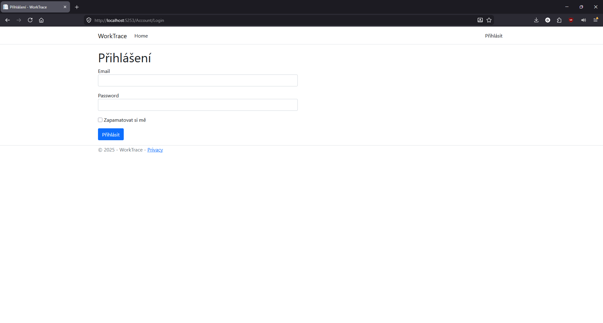

# WorkTrace – docházkový systém pro malé a střední podniky

WorkTrace je webová aplikace pro správu docházky a absencí zaměstnanců. 
Systém umožňuje evidenci pracovní doby, žádostí o dovolenou a dalších absencí, a to včetně správy zaměstnanců, poboček, typů úvazků a systémových nastavení.

## Použité technologie

- **ASP.NET Core**
- **Entity Framework Core**
- **ASP.NET Core Identity**
- **SQL Server**
- **C#**
- **HTML / CSS / JavaScript**

## Hlavní funkce

### Role a oprávnění

Systém využívá aplikační role ASP.NET Core Identity:

| Role         | Možnosti |
|--------------|----------|
| **Zaměstnanec** | – Zápis vlastních příchodů, odchodů a přestávek – Vytváření, úprava a mazání vlastních žádostí o absenci – Prohlížení osobní docházky a stavu žádostí |
| **Manažer**    | *Role je připravena pro budoucí rozšíření* – v aktuální verzi nemá speciální oprávnění |
| **Administrátor** | – Správa uživatelů a zaměstnanců – Správa číselníků (pobočky, typy úvazků, typy absencí, pracovní role) – Konfigurace systémových nastavení (např. délka pracovního dne) – Úprava či mazání libovolných záznamů docházky a absencí |

### Datové entity

- **Zaměstnanec** – osobní údaje, PIN kód pro docházkový terminál, přiřazení k pobočce, pracovní roli a typu úvazku
- **Záznam docházky** – datum, časy příchodu/odchodu, přestávky, automatický výpočet odpracované doby (zaokrouhlení na čtvrthodiny)
- **Žádost o absenci** – typ absence, období, důvod, stav (čeká, schváleno, zamítnuto)
- **Ostatní** – pobočky, typy úvazků (HPP, DPP, DPČ s hodinovou mzdou), typy absencí (dovolená, nemoc, neplacené volno), pracovní role pro HR
- **Systémová nastavení** – klíč–hodnota pro konfiguraci (např. délka pracovního dne)

